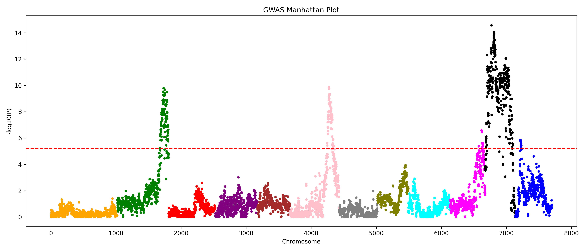
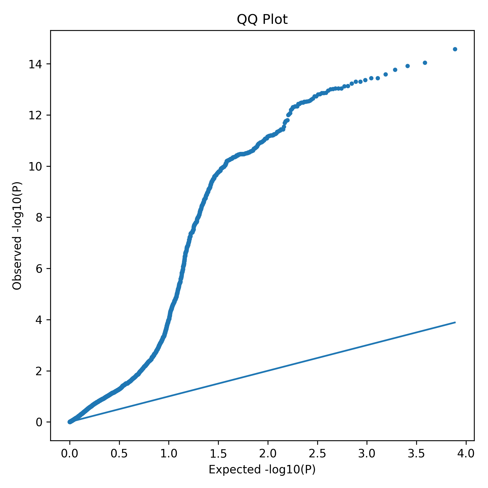
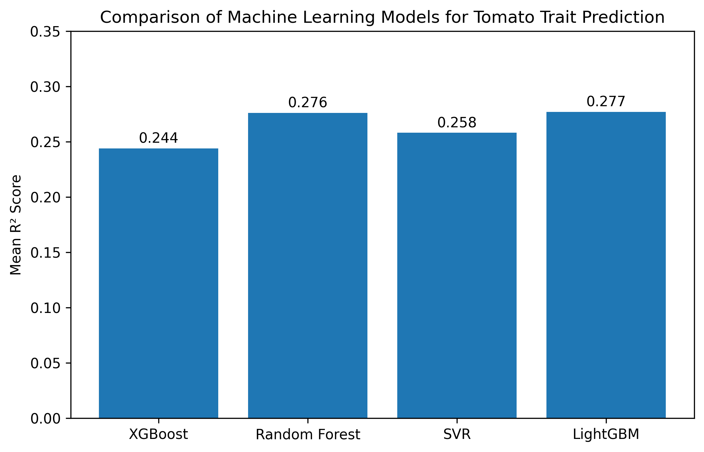
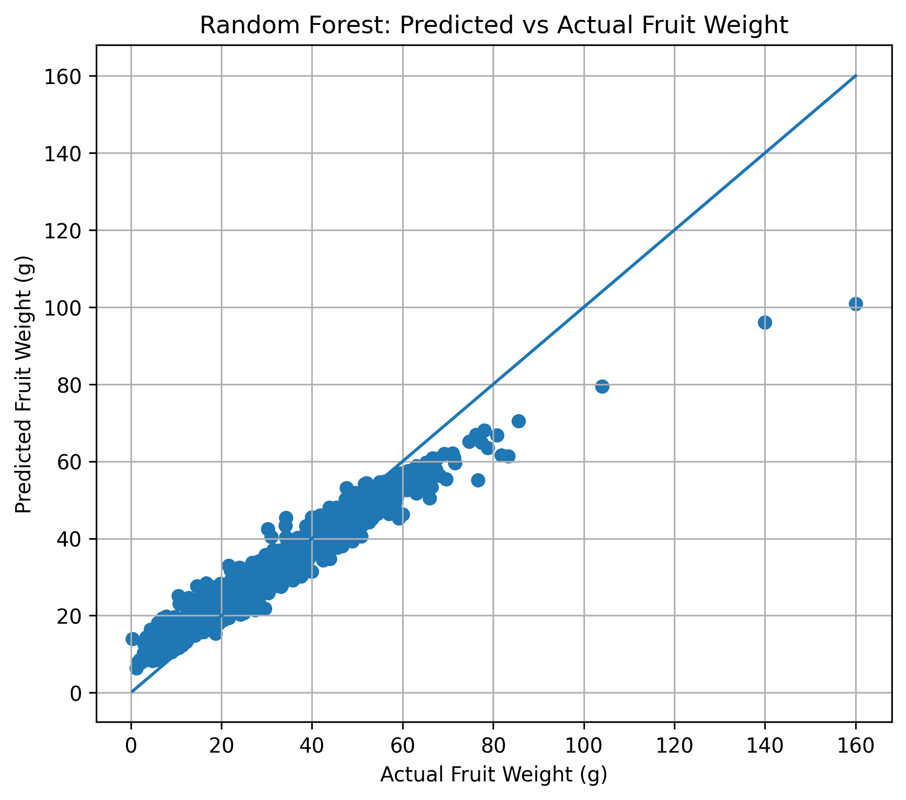
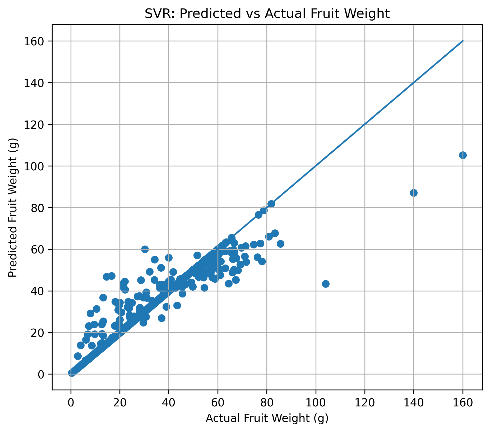
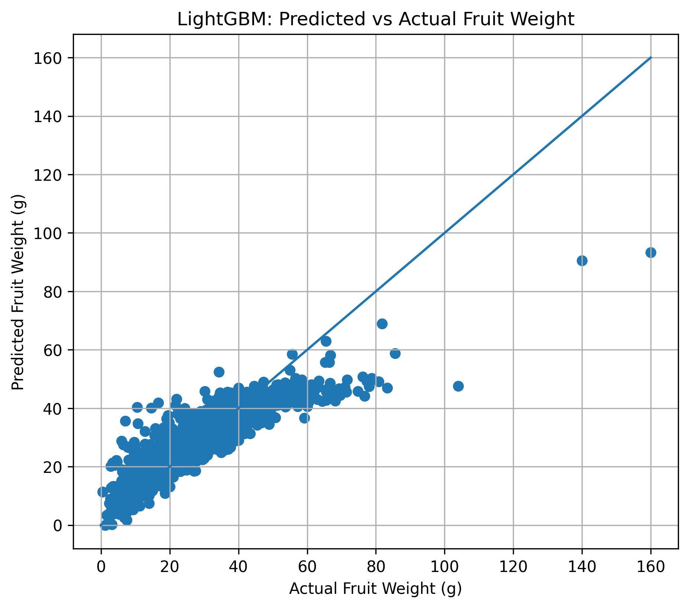
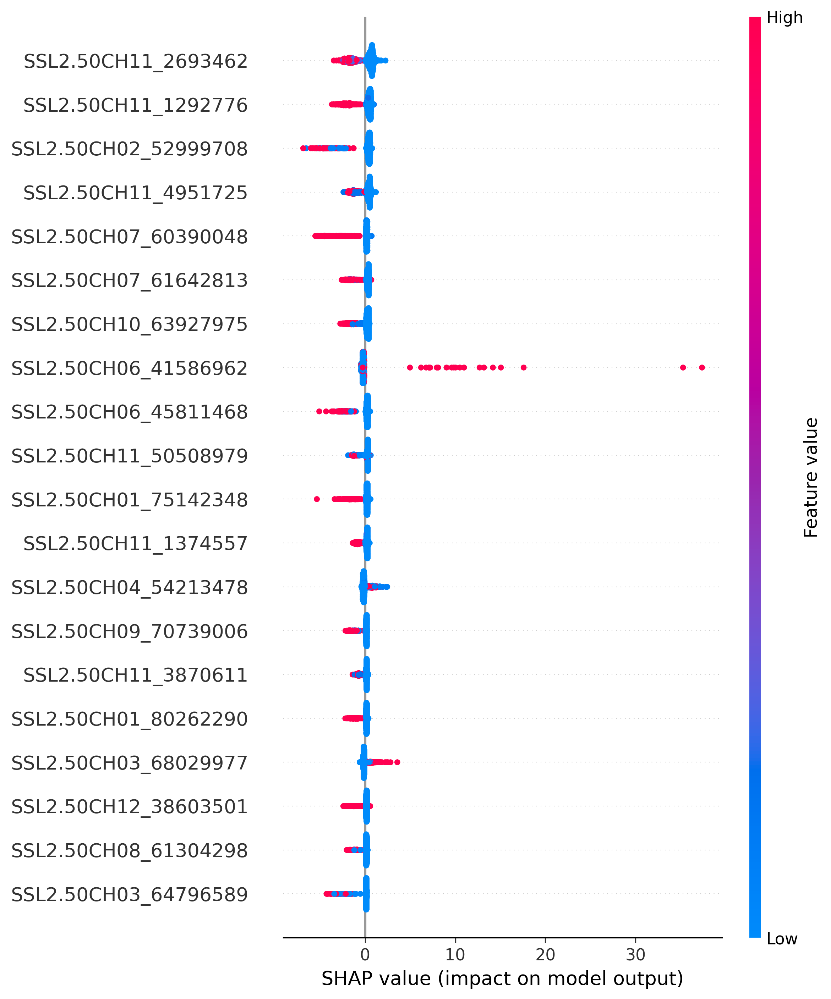

# 🍅 AI-Based Tomato Fruit Weight Prediction Using SNP Markers, GWAS, Machine Learning and Explainable AI

## Abstract

Plant breeding traditionally depends on extensive field experiments to identify plants with desirable agricultural traits. Although effective, conventional breeding requires multiple generations, large resources, and significant time.

This project presents an **AI-based genomic prediction framework** for predicting tomato fruit weight using genome-wide **Single Nucleotide Polymorphism (SNP)** markers.

The proposed system integrates:

- Genome-Wide Association Study (GWAS)
- SNP-based genomic analysis
- Machine learning regression models
- Explainable Artificial Intelligence (XAI)
- Candidate gene identification
- Interactive genomic visualization

Four machine learning algorithms were implemented and compared:

- XGBoost Regression
- Random Forest Regression
- Support Vector Regression (SVR)
- LightGBM Regression

The models learn relationships between thousands of SNP markers and tomato fruit weight variation.

SHAP (SHapley Additive exPlanations) analysis was applied to identify the most influential SNP markers contributing to model predictions.

The developed framework demonstrates how artificial intelligence and genomics can be combined for **genomic-assisted breeding and precision agriculture**.

---

# 1. Introduction

## 1.1 Background

Crop improvement programs aim to develop plants with improved characteristics such as:

- Higher yield
- Increased fruit size
- Better quality
- Disease resistance
- Environmental adaptability

Traditional breeding methods require evaluating plants through multiple generations of field trials.

Although successful, these methods are:

- Time-consuming
- Expensive
- Dependent on environmental conditions

Modern genomic approaches use DNA-level information to accelerate breeding decisions.

Single Nucleotide Polymorphisms (SNPs) are widely used genetic markers that represent variations in DNA sequences between individuals.

By combining SNP information with machine learning, complex relationships between genetic variation and plant traits can be modeled.

---

# 2. Research Motivation

Tomato fruit weight is a quantitative trait controlled by multiple genes and genomic regions.

Understanding these genetic factors can help accelerate tomato improvement programs.

The motivation of this project is to develop a computational framework that can:

1. Identify genomic regions associated with fruit weight.
2. Predict fruit weight using only genetic information.
3. Identify important SNP markers influencing predictions.
4. Connect significant SNPs with biological candidate genes.
5. Provide an interactive platform for genomic analysis.

---

# 3. Project Objectives

## Genetic Analysis Objectives

- Analyze genome-wide SNP variation.
- Perform Genome-Wide Association Study (GWAS).
- Identify SNP markers associated with tomato fruit weight.
- Study chromosome-wise SNP distribution.

## Machine Learning Objectives

- Develop genomic prediction models using SNP markers.
- Compare multiple regression algorithms.
- Evaluate prediction accuracy using statistical metrics.

## Explainable AI Objectives

- Identify important SNP markers.
- Measure SNP contribution to predictions.
- Interpret machine learning results biologically.

## Application Objectives

- Develop an interactive Streamlit dashboard.
- Visualize genomic results.
- Predict fruit weight for individual tomato plants.

---

# 4. Biological Background

## 4.1 Single Nucleotide Polymorphism (SNP)

A Single Nucleotide Polymorphism is a variation at a single nucleotide position in the DNA sequence among individuals.

Example:

Plant A:

A T G C

Plant B:

A T A C

The nucleotide difference represents a SNP.

SNP markers act as genetic fingerprints and are widely used in:

- Genetic mapping
- GWAS studies
- Genomic selection
- Crop improvement

---

# 5. Dataset Description

## 5.1 Dataset Source

The dataset used in this project is:

**Solanum pennellii Backcross Inbred Lines (BILs) Population**

Dataset Repository:

https://datadryad.org/dataset/doi:10.5061/dryad.2fqz612wx

The dataset contains:

- Genome-wide SNP marker information
- Tomato plant identifiers
- Phenotypic measurements
- Fruit weight observations

---

# 6. Dataset Statistics

| Parameter | Value |
|-----------|-------|
| Species | Tomato |
| Population | Solanum pennellii BILs |
| Number of Plants | 1148 |
| SNP Markers | 7699 |
| Number of Chromosomes | 12 |
| Target Trait | Fruit Weight (BILs FW(gr)) |

---

# 7. Genotype Dataset

The genotype dataset contains SNP marker information for each tomato plant.

Example:

| Plant ID | SNP1 | SNP2 | SNP3 |
|----------|------|------|------|
| p-1-1 | 1 | 3 | 1 |
| p-10-1 | 3 | 1 | 3 |

Each SNP column represents a genetic marker position.

The genotype matrix is used as input features for machine learning models.

---

# 8. SNP Encoding

The original genotype dataset is already numerically encoded.

The encoding represents inheritance from two parental lines.

Encoding:

1 → Parent 1 allele

3 → Parent 2 allele

Example:

SNP1 = 1

The plant contains Parent 1 allele

SNP2 = 3

The plant contains Parent 2 allele

These encoded values allow machine learning algorithms to process genetic variation mathematically.

---

# 9. Phenotype Dataset

The phenotype dataset contains measured physical characteristics of tomato plants.

The target trait selected in this project is:

Fruit Weight (BILs FW(gr))

Example:

| Plant ID | Fruit Weight |
|----------|--------------|
| p-1-1 | 24.7 g |
| p-10-1 | 35.4 g |

The objective of the prediction models is:

Input:

SNP genotype profile

Output:

Predicted fruit weight

---

# 10. Complete Computational Workflow

             SNP Genotype Data

                     |

                     ↓

          Data Preprocessing

                     |

                     ↓

          Genome-Wide Association Study

                     |

                     ↓

         Significant SNP Identification

                     |

                     ↓

          Machine Learning Models

      --------------------------------

      |              |              |

   XGBoost      Random Forest      SVR

                     |

                  LightGBM

                     |

                     ↓

             Model Evaluation

                     |

                     ↓

            SHAP Explainability

                     |

                     ↓

          Candidate Gene Analysis

                     |

                     ↓

          Streamlit Web Application

---

# 11. Data Preprocessing

Before performing GWAS and machine learning, the raw datasets were processed.

## Steps Performed

### 1. Genotype Quality Checking

The genotype data was examined for:

- Missing values
- Incorrect formatting
- Sample consistency
- Duplicate information

---

### 2. Phenotype Processing

The phenotype dataset was processed to:

- Select fruit weight as target trait.
- Remove incomplete measurements.
- Maintain correct plant identifiers.

---

### 3. Genotype-Phenotype Alignment

Both datasets were matched using Plant ID.

Only plants containing:

- Complete SNP information
- Valid fruit weight measurements

were retained.

Final dataset:

Samples:

1148 tomato plants

Features:

7699 SNP markers

Target:

Fruit Weight

---
# 12. Genome-Wide Association Study (GWAS)

## 12.1 Overview

Genome-Wide Association Study (GWAS) is a statistical approach used to identify genetic variants associated with specific biological traits.

In this project, GWAS was performed to identify SNP markers associated with tomato fruit weight.

Each SNP marker was individually tested to determine whether genetic variation at that location contributes to differences in fruit weight.

---

## 12.2 GWAS Principle

The basic workflow of GWAS:

SNP Marker

  +

Phenotypic Trait

  ↓

Statistical Association Test

  ↓

P-value Calculation

  ↓

Significant SNP Identification

A smaller p-value indicates stronger evidence that a SNP is associated with fruit weight.

---

## 12.3 GWAS Output

The GWAS analysis generated:

- SNP association table
- Chromosome information
- SNP positions
- P-values
- Manhattan plot
- QQ plot

Example significant SNP:

SNP:

SSL2.50CH11_2693462

P-value:

2.66 × 10^-15

---

# 13. Manhattan Plot Analysis

The Manhattan plot provides a genome-wide visualization of SNP-trait associations.

## Interpretation

### X-axis

Represents:

Chromosome position

### Y-axis

Represents:

-log10(P-value)

Each point represents an individual SNP marker.

Higher peaks indicate genomic regions with stronger associations with tomato fruit weight.

These significant regions may contain genes responsible for fruit development and weight regulation.

---

# 14. QQ Plot Analysis

The Quantile-Quantile (QQ) plot evaluates the statistical reliability of GWAS results.

## Interpretation

The QQ plot compares:

Expected SNP distribution

    vs

Observed SNP association values

A well-calibrated GWAS result follows the diagonal line.

Deviation from the diagonal indicates SNPs with significant associations.

---

# 15. Machine Learning Based Genomic Prediction

After identifying genomic variation, machine learning models were developed to predict tomato fruit weight using SNP profiles.

## Input Features

The input to the models:

7699 SNP markers

Example genotype profile:

1,3,1,3,3,1,1,...

## Prediction Output

The models predict:

Fruit Weight (grams)

The models learn complex relationships between SNP combinations and phenotypic variation.

---

# 16. Machine Learning Models

Four regression algorithms were implemented and compared.

---

# 16.1 XGBoost Regression

XGBoost (Extreme Gradient Boosting) is an ensemble machine learning algorithm based on decision trees.

Advantages:

- Handles high-dimensional genomic data
- Captures nonlinear SNP interactions
- Provides feature importance analysis
- Robust against overfitting

Performance:

Mean R² Score:

0.244

---

# 16.2 Random Forest Regression

Random Forest is an ensemble learning method that combines multiple decision trees.

Advantages:

- Handles thousands of SNP features
- Reduces overfitting
- Captures complex genetic relationships

Performance:

Mean R² Score:

0.276

---

# 16.3 Support Vector Regression (SVR)

Support Vector Regression uses kernel-based learning to model complex relationships between genotype and phenotype.

Advantages:

- Effective for high-dimensional datasets
- Works well when number of features is large
- Provides stable prediction performance

Performance:

Mean R² Score:

0.258

---

# 16.4 LightGBM Regression

LightGBM is a gradient boosting framework optimized for fast training and efficient handling of large feature spaces.

Advantages:

- Faster gradient boosting implementation
- Efficient memory usage
- Handles thousands of SNP markers

Performance:

Mean R² Score:

0.277

---

# 17. Model Evaluation

The performance of each model was evaluated using the coefficient of determination (R²).

## R² Score

R² represents how much variation in fruit weight can be explained by SNP information.

Formula:

R² = 1 - (Residual Variation / Total Variation)

Higher R² values indicate better prediction ability.

---

# 18. Model Performance Comparison

| Model | Mean R² | Standard Deviation |
|-------|---------|-------------------|
| XGBoost | 0.244 | 0.051 |
| Random Forest | 0.276 | 0.041 |
| SVR | 0.258 | 0.036 |
| LightGBM | 0.277 | 0.054 |

---

# 19. Model Comparison Visualization

## Observation

The comparison shows:

- LightGBM achieved the highest average R² score.
- Random Forest produced comparable performance.
- SVR showed stable prediction behaviour.
- XGBoost successfully captured SNP-based relationships.

---

# 20. Predicted vs Actual Analysis

Predicted versus actual plots were generated to evaluate model prediction quality.

## XGBoost Prediction

## Random Forest Prediction

## SVR Prediction

## LightGBM Prediction

## Interpretation

The diagonal line represents ideal prediction.

Points closer to the diagonal indicate:

- Better prediction accuracy
- Stronger relationship between predicted and observed fruit weight

---

# 21. Model Selection

Based on cross-validation performance:

Best Performing Model:

LightGBM Regression

Mean R²:

0.277

However, all models were retained because different algorithms capture different patterns within genomic datasets.

---

# 22. Explainable Artificial Intelligence (SHAP Analysis)

Machine learning models provide predictions but do not directly explain biological reasons behind those predictions.

To overcome this limitation, SHAP analysis was performed.

---

## 22.1 SHAP Principle

SHAP (SHapley Additive exPlanations) calculates the contribution of each SNP marker toward the final prediction.

Workflow:

Trained ML Model

    ↓

SHAP Value Calculation

    ↓

SNP Importance Ranking

    ↓

Biological Interpretation

SHAP values indicate:

- Positive contribution → increases predicted fruit weight
- Negative contribution → decreases predicted fruit weight

---

# 23. SHAP Summary Plot

## Interpretation

The SHAP summary plot displays:

- Most influential SNP markers
- Direction of SNP influence
- Relative importance of genetic features

The SNPs at the top have the highest impact on model predictions.

---

# 24. Candidate Gene Identification

Important SNP markers identified through SHAP analysis were further investigated for nearby genes.

Workflow:

Important SNP

    ↓

Chromosome Location

    ↓

Nearby Gene Search

    ↓

Biological Function Analysis

    ↓

Trait Association

Candidate gene identification connects machine learning results with biological knowledge.

# 25. Candidate Gene Analysis

The important SNP markers identified through SHAP analysis represent genomic regions that may influence tomato fruit weight.

To understand the biological relevance of these SNPs, nearby genes were investigated.

The workflow:

Important SNP Marker

      ↓

Chromosome Position

      ↓

Nearby Gene Identification

      ↓

Gene Function Analysis

      ↓

Trait Association

Candidate gene analysis helps connect computational predictions with biological mechanisms controlling fruit development.

---

# 26. Tomato Fruit Weight Related Candidate Genes

## 26.1 FAS (FASCIATED)

FAS is one of the major tomato fruit size regulatory genes.

Functions:

- Controls carpel number development.
- Influences fruit size.
- Regulates locule formation.
- Contributes to fruit weight variation.

Changes in FAS activity can result in differences in tomato fruit morphology and size.

---

## 26.2 LC (LOCULE NUMBER)

LC is another important tomato fruit development gene.

Functions:

- Controls the number of locules inside tomato fruits.
- Regulates floral meristem development.
- Influences fruit size and weight.

Higher locule number is generally associated with larger tomato fruits.

---

## 26.3 SUN

SUN is a major tomato fruit shape gene.

Functions:

- Controls fruit elongation.
- Regulates cell division patterns.
- Influences fruit morphology.

SUN demonstrates how genetic variation can affect visible plant characteristics.

---

# 27. Chromosome-wise SNP Distribution

The SNP distribution across chromosomes was analyzed to understand genome coverage.

## Interpretation

The tomato genome contains:

12 Chromosomes

7699 SNP Markers

The chromosome distribution plot confirms that SNP markers are distributed throughout the complete tomato genome.

This ensures that the prediction models utilize genome-wide genetic information.

---

# 28. Streamlit Interactive Prediction System

A Streamlit-based web application was developed to provide an interactive interface for genomic prediction and visualization.

The application integrates:

- Machine learning prediction
- GWAS visualization
- SHAP interpretation
- SNP information
- Candidate gene information

---

# 28.1 Fruit Weight Prediction

Users can select a tomato plant ID.

The application provides:

- Actual fruit weight
- Predicted fruit weight
- Prediction model output
- Important SNP markers

Example:

Plant ID:

p-1-1

Actual Fruit Weight:

24.7 g

Predicted Fruit Weight:

26.1 g

---

# 28.2 GWAS Visualization

The application displays:

- Manhattan Plot
- QQ Plot

This allows users to explore genomic regions associated with fruit weight.

---

# 28.3 SHAP Interpretation Dashboard

The dashboard provides:

- Top important SNP markers
- SHAP feature ranking
- SNP contribution information

This improves the interpretability of machine learning predictions.

---

# 28.4 Genomic Information Explorer

The application provides information about:

- SNP locations
- Chromosome positions
- Candidate genes
- Biological interpretation

---

# 29. Project Repository Structure

tomato_project/

│
├── app/
│ └── app.py
│
├── data/
│ ├── genotype_data
│ └── phenotype_data
│
├── graphs/
│ ├── model_comparison_plot.py
│ ├── chromosome_distribution.py
│ └── predicted_actual_plot.py
│
├── scripts/
│ ├── preprocessing.py
│ ├── gwas.py
│ ├── xgboost_prediction.py
│ ├── random_forest_prediction.py
│ ├── svr_prediction.py
│ ├── lightgbm_prediction.py
│ ├── shap_analysis.py
│ └── candidate_gene_annotation.py
│
├── outputs/
│ ├── GWAS Results
│ ├── ML Models
│ ├── SHAP Results
│ └── Visualization Graphs
│
├── requirements.txt
│
└── README.md

---

# 30. Technologies Used

## Programming Language

- Python

## Data Processing

- Pandas
- NumPy

## Machine Learning

- XGBoost
- Random Forest
- Support Vector Regression
- LightGBM
- Scikit-learn

## Genomics Analysis

- Genome-Wide Association Study
- SNP Analysis

## Explainable AI

- SHAP

## Visualization

- Matplotlib

## Web Application

- Streamlit

---
